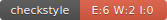
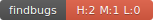

# bordertech badger
Provides a Maven plugin to generate status badges for:
* CheckStyle
* PMD
* FindBugs
* JaCoCo

## Status

[](https://circleci.com/gh/BorderTech/badger)
[](https://www.codacy.com/app/BorderTech/badger?utm_source=github.com&amp;utm_medium=referral&amp;utm_content=BorderTech/badger&amp;utm_campaign=Badge_Grade)

## Example Badges

These are the badges for the Badger project itself:


Here are some examples of badges where issues are detected:





## Example Usage

```xml
<build>
	<plugins>
		<!-- Generate badges. -->
		<plugin>
			<groupId>com.github.bordertech.buildtools</groupId>
			<artifactId>badger</artifactId>
			<version>1.0.0</version>
			<executions>
				<execution>
					<phase>post-site</phase>
					<goals>
						<goal>badges</goal>
					</goals>
					<configuration>
						<skip>${badges.skip}</skip>
						<outputDir>target/site/badges</outputDir>
						<inputFiles>
							<inputFile>target/pmd.xml</inputFile>
							<inputFile>target/findbugs-report.xml</inputFile>
							<inputFile>target/findbugsXml.xml</inputFile>
							<inputFile>target/checkstyle-result.xml</inputFile>
							<inputFile>target/coverage-report.xml</inputFile>
						</inputFiles>
					</configuration>
				</execution>
			</executions>
		</plugin>
	</plugins>
</build>
```

